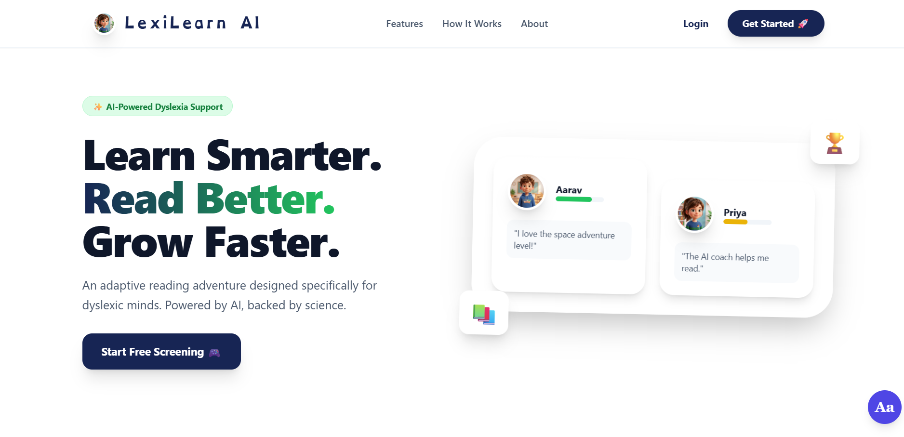
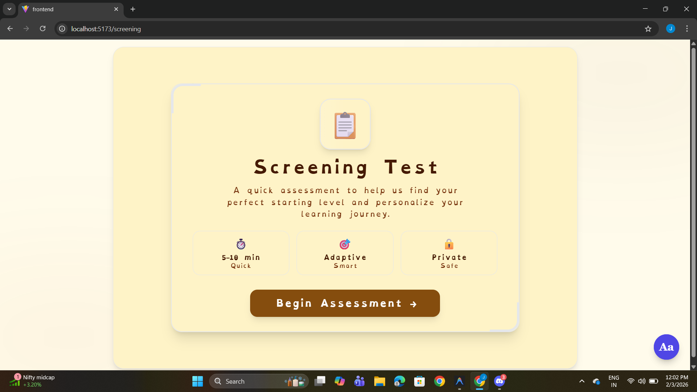
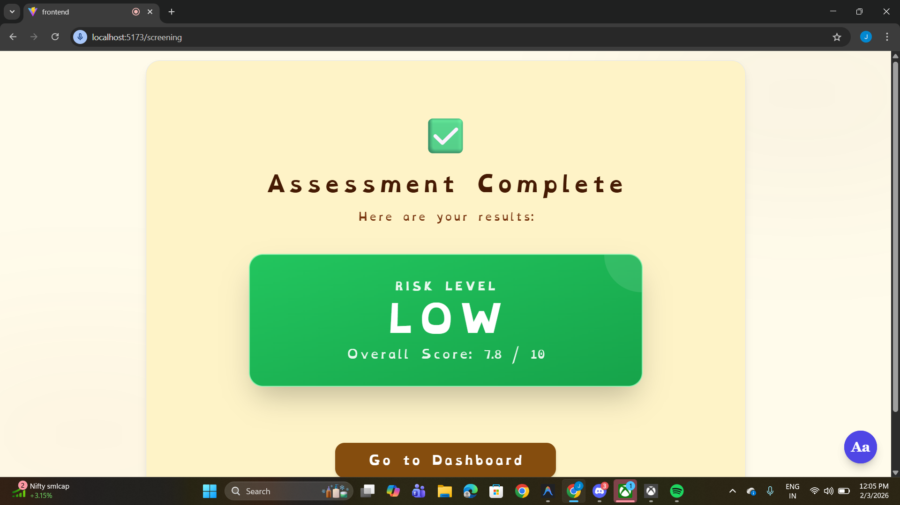
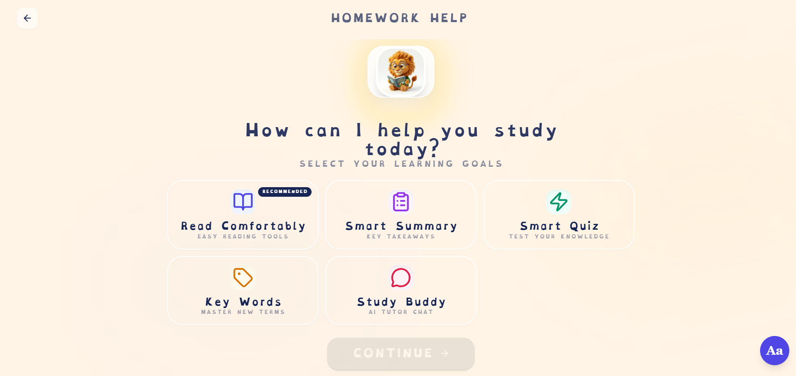
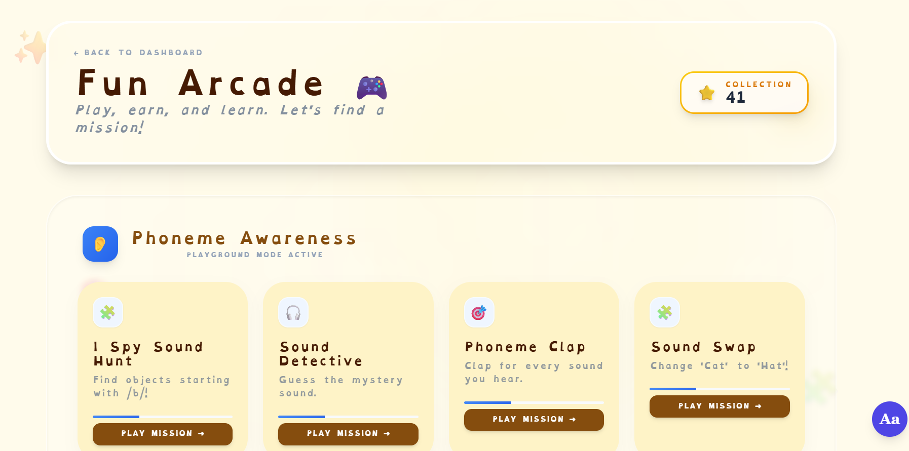
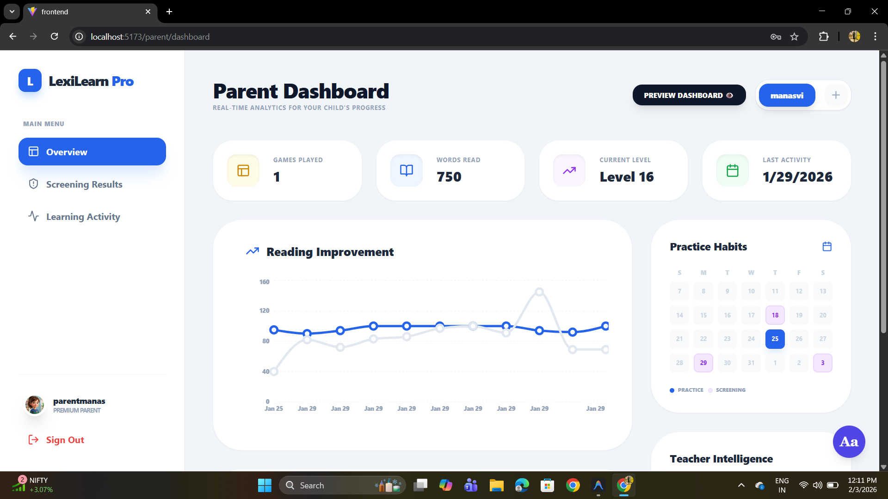
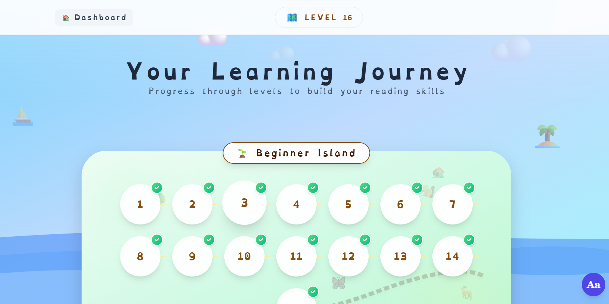

# Lexilearn AI: Empowering Dyslexic Learners with AI 🚀

Lexilearn AI is a comprehensive, AI-powered platform designed specifically to support children with dyslexia. By leveraging state-of-the-art AI agents, the platform offers adaptive learning, real-time coaching, and engaging gamified experiences to make reading and learning more accessible and enjoyable.

---

## 📸 Screenshots

### 🏠 Landing Page
Clean and accessible entry interface introducing the platform and its adaptive learning approach.


---
### 📝 AI Screening Test
Professional assessment interface designed to evaluate reading abilities and detect learning patterns.


---
### 📊 Screening Results
Detailed AI-generated performance insights with identified strengths and improvement areas.



---
### 🤖 Smart Homework Help
AI-powered homework assistant delivering simplified explanations and contextual guidance.



---
### 🎮 Fun Arcade
Gamified cognitive and phonics-based activities to enhance engagement and skill development.



---

### 👨‍👩‍👧 Parent Dashboard
Comprehensive analytics dashboard tracking student progress, accuracy, and improvement trends.



---
### 📖 Reading Practice
Interactive reading module with real-time AI feedback and guided coaching.



---


## ✨ Key Features

- **🎯 AI Reading Screening**: A professional, production-grade assessment tool to identify reading levels and specific challenges.
- **🎙️ AI Reading Coach**: Real-time voice interaction where a "cute" AI assistant listens, encourages, and provides instant feedback on reading accuracy and fluency.
- **📁 Smart Homework Help**: Powered by advanced AI agents to help students understand complex assignments through simplified explanations and interactive guidance.
- **📊 Parent/Teacher Dashboard**: Detailed insights into progress, accuracy, and areas needing improvement.
- **🎮 Gamified Learning**: Engaging activities like "Sound Match" and "Level Finder Games" to keep learners motivated.
- **🎨 Dyslexia-Friendly UI**: Optimized with specialized fonts (like OpenDyslexic) and high-contrast, calm color themes.

---

## 🛠️ Tech Stack

### Frontend
- **React & Vite**: Modern, high-performance web framework.
- **Vanilla CSS**: Custom, high-end styling with glassmorphism and smooth animations.
- **Supabase Auth**: Secure and reliable user authentication.

### Backend
- **FastAPI**: Robust, high-speed Python backend.
- **Google Gemini AI**: Powering the intelligent agents for screening, coaching, and insights.
- **Whisper (STT)**: Advanced speech-to-text integration for reading practice.
- **LangChain & LangGraph**: Orchestrating complex AI agent workflows.

---

## 🚀 Getting Started

### Prerequisites
- Node.js (v18+)
- Python (v3.9+)
- Supabase Account
- Google Gemini API Key

### Installation

1. **Clone the repository:**
   ```bash
   git clone https://github.com/YOUR_USERNAME/Lexilearn_AI.git
   cd Lexilearn_AI
   ```

2. **Backend Setup:**
   ```bash
   cd backend
   python -m venv .venv
   source .venv/bin/activate  # On Windows: .venv\Scripts\activate
   pip install -r requirements.txt
   # Configure your .env file with Gemini and Supabase keys
   uvicorn main:app --reload
   ```

3. **Frontend Setup:**
   ```bash
   cd ../frontend
   npm install
   # Configure your .env file with Supabase keys
   npm run dev
   ```

---

## 🏗️ Project Structure
```text
Lexilearn_AI/
├── backend/            # FastAPI server & AI Agent logic
│   ├── agents/         # Specific AI agent implementations
│   ├── uploads/        # Audio and document temporary storage
│   └── main.py         # Entry point
├── frontend/           # React application
│   ├── src/pages/      # Feature-specific pages (Screening, Dashboard, etc.)
│   └── src/components/ # Shared UI components
└── README.md           # This file!
```

---

## 🤝 Contributing
We welcome contributions! Please feel free to submit a Pull Request or open an issue.

## 📄 License
This project is licensed under the MIT License.

---
*Built with ❤️ for accessible education.*
